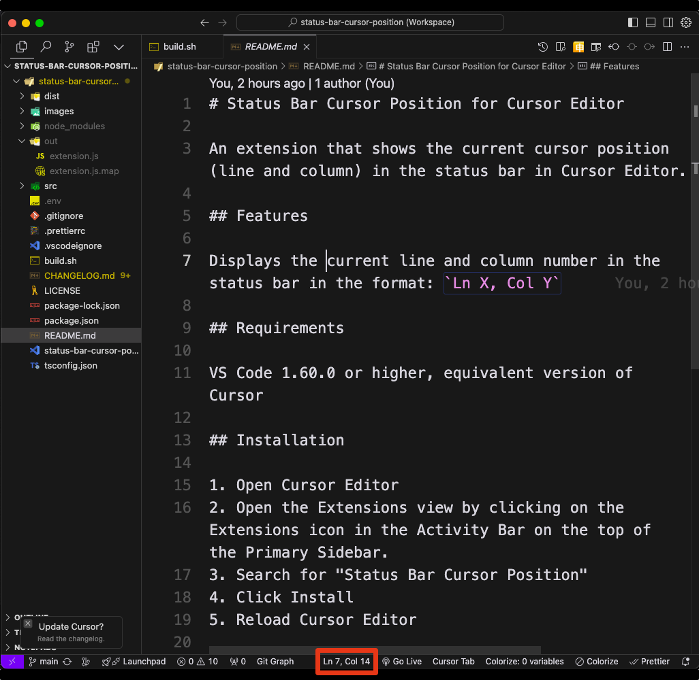

# Status Bar Cursor Position for Cursor Editor

An extension that shows the current cursor position (line and column) in the status bar in Cursor Editor.

## Features

Displays the current line and column number in the status bar in the format: `Ln X, Col Y`

## Requirements

VS Code 1.93.0 or higher, equivalent version of Cursor

## Installation

1. Open Cursor Editor
2. Open the Extensions view by clicking on the Extensions icon in the Activity Bar on the top of the Primary Sidebar.
3. Search for "Status Bar Cursor Position"
4. Click Install
5. Reload Cursor Editor
